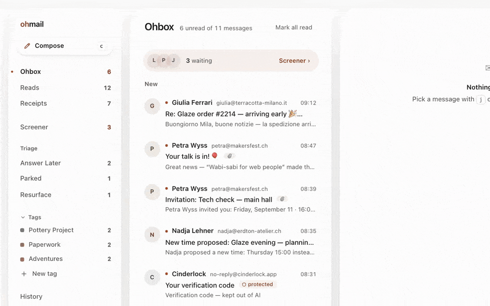
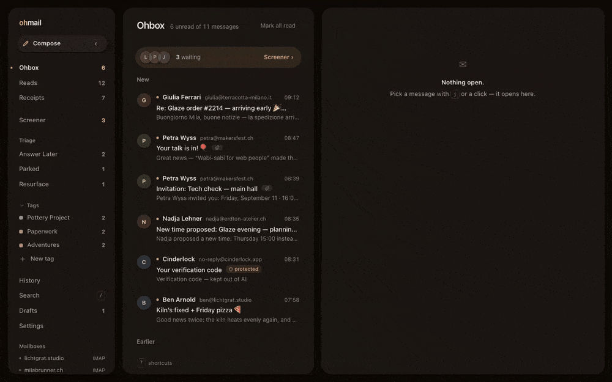
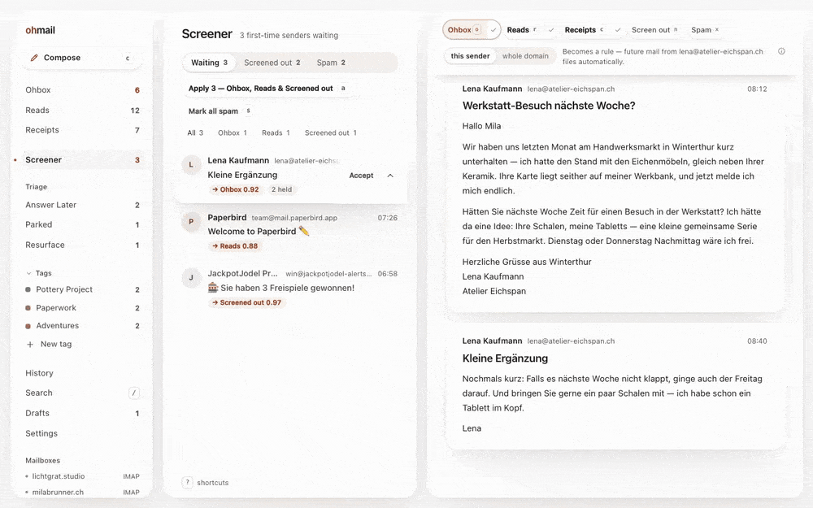
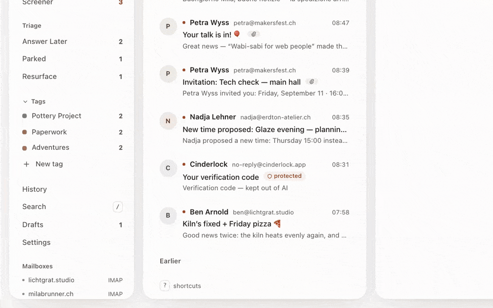
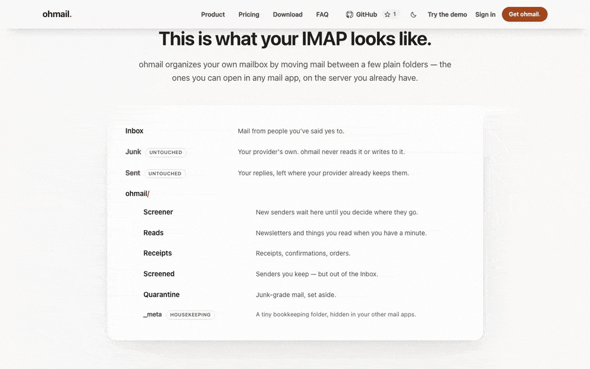
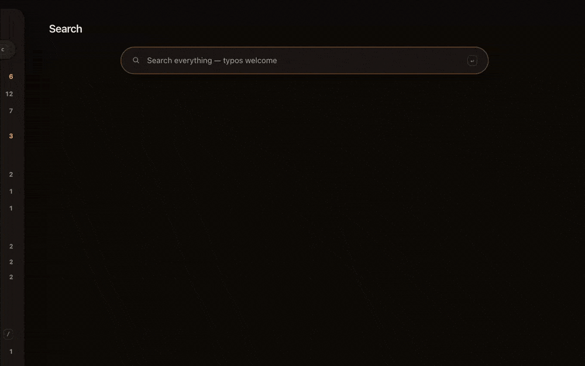
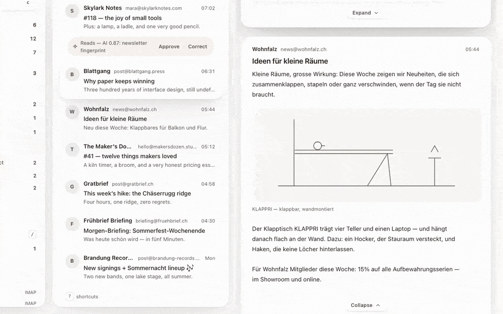
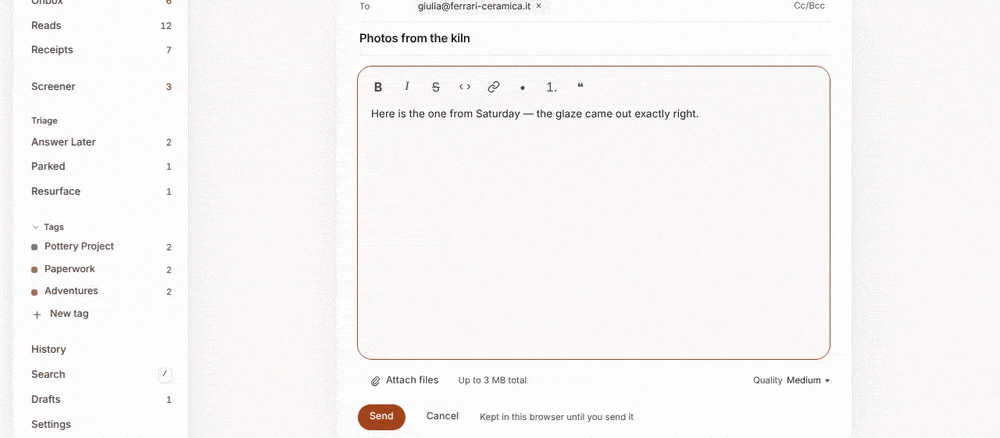

<div align="center">


# ohmail

**Consent-first email, on the mailboxes you already have.**

First-time senders wait at the Screener until you let them in, and everything
you said yes to is organized in place — real folders on your own IMAP server.
This repository is the free desktop app for macOS, Windows and Linux — and the
server source behind ohmail.app beside it: the whole program, all of its
source, AGPL-3.0, no account.

[**Download the latest release**](https://github.com/trafficflowhq/ohmail/releases/latest) ·
[try the demo in your browser](https://ohmail.app/demo) ·
[ohmail.app](https://ohmail.app)

[](https://github.com/trafficflowhq/ohmail/actions/workflows/build.yml)
[](https://github.com/trafficflowhq/ohmail/stargazers)
[](https://github.com/trafficflowhq/ohmail/releases/latest)
[](LICENSE)
[](#macos)
[](#windows)
[](#linux)

A star helps other people find this. If ohmail is your kind of mail client,
leave one.

</div>

---

## Only consent-first mail in your Ohbox

The first time someone writes to you, they wait at the Screener — not in your
inbox. The Ohbox holds the people you said yes to, every message names the rule
that filed it, and a tracking pixel is never requested.



## Ohbox · Reads · Receipts

Three views instead of one pile: people in the Ohbox, newsletters in Reads with
a waterline where you stopped, paperwork in Receipts with its numbers on the
row. Each is backed by a real folder on your own mail server.



## The AI Screener

With AI on — your own Anthropic key or a local model through
[Ollama](https://ollama.com), and off until you turn it on — the Screener
proposes a door for each waiting sender, with a confidence and a reason, and
one press accepts. Switch on auto-suggest and the proposal is already waiting
as the mail arrives. Nothing applies itself until you have confirmed a pattern
often enough for it to graduate; from then on that one pattern files itself,
spam included, every move recorded and reversible. A one-time code inside a
message is stripped before any model sees it, and automatic routing leaves
that mail alone entirely.

Spam needs no AI at all: one press files the message into your mailbox's own
Junk folder — where the mailbox has one — and the sender rule remembers, so
the next mail from that sender never reaches the gate. Screening out or
marking spam also sends the list's one-click unsubscribe on your behalf, where
one is offered (on by default; a switch turns it off; not yet in the
standalone desktop app). Plain newsletters and
receipts can be filed out of the Screener by deterministic rules alone, once
you switch that on. ohmail deletes nothing on its own.



## All your mailboxes

Gmail, Microsoft 365 and Outlook.com, iCloud, Fastmail, your own server — if it
speaks IMAP, ohmail organizes it. One Screener stands in front of all of them,
and every reply leaves from whichever of your addresses you choose.



## Your mail keeps living in your IMAP folders

Every decision lands as a real folder in your own account, readable by any
other mail app, forever. Leave anytime — cancel, sign out, or just open a
different client — and your mailbox is already organized.



## Fast search

Search answers as you type, typo-tolerant, over a local mirror on your own
machine — scoped by sender, folder or tag when you want it narrow. The full
archive on your server is one keystroke further.



## Dark mode

Light and dark, one press apart — HTML mail included, redrawn for a dark screen
with the sender's original one click away.



## Photos are compressed before they are sent

Attach a **JPEG or a PNG** and it is compressed automatically, on your own
machine, before anything is uploaded — client-side, so there is no waiting on
a server. The Quality dial beside the attach button — **Low**, **Medium**,
**High**, or **Original** for no compression at all — picks how much; Medium
is the default, and the choice is remembered per account. Other formats,
including the HEIC a modern iPhone writes, are sent exactly as they are.



<sub>Every frame above is the shipped interface over a demo mailbox —
fictional people, fictional brands, zero network. It is the same demo you can
open at [ohmail.app/demo](https://ohmail.app/demo); the app itself carries no
demo mail and opens empty until you connect a mailbox.</sub>

## Your existing mailbox remains the source of truth

Not a slogan — the architecture. ohmail's desktop app, the hosted service and
a server you run never share a database; the only medium they all read is the
mailbox itself, so that is where everything durable lives:

- **Your mail and its organization** are real IMAP folders on your own server —
  the `ohmail/*` tree plus any folders of your own — moved by ordinary IMAP
  commands, readable by any client, kept when you leave.
- **Your settings, rules and screening structure** are one small versioned-JSON
  message in the hidden `ohmail/_meta` folder — the portable organizer profile,
  specified in [docs/organizer-profile.md](docs/organizer-profile.md).
- **Which ohmail organizes the mailbox** is decided in the mailbox too: a lease
  message in the same `_meta` folder names the one active organizer, so a
  desktop install, a self-hosted server and the hosted service can hand a
  mailbox to one another without ever talking to one another.

So switching between hosting types is reconnecting a mailbox. Connect the same
mailbox from a desktop install, from a server you run, or from
[ohmail Cloud](https://ohmail.app), and ohmail finds the settings stored in it
and asks before using them. What a deployment keeps to itself is the working
copy — the local mirror, cached bodies, device pairings, billing —
reconstructible from the mailbox or irrelevant to it, plus the honest edge:
decisions with no IMAP representation yet. Triage piles, Resurface timers,
learned patterns, which tag is on which message, notes, snippets and the app's
own preference switches all stay with the deployment they were made on — the
mail, its folders and the profile above are what travel.

## Your settings live in your mailbox, and move with it

The senders you've screened in, your rules, your notification choices, your
away reply and your tag names are stored **in the mailbox itself** — a few
kilobytes of versioned JSON in the hidden `ohmail/_meta` folder, written by
whichever organizer is active. Connect the same mailbox from a desktop
install, from [ohmail Cloud](https://ohmail.app) or from a server you run, and
ohmail finds them and asks first: *"We found your ohmail settings on this
mailbox."* No export step, no transfer flow, no account linkage — switching
how you run ohmail is reconnecting a mailbox, not migrating a product.

And if you stop using ohmail entirely, those decisions are still yours: in
your own mailbox, in a published format anything can parse —
[docs/organizer-profile.md](docs/organizer-profile.md) is the specification.
Rules that live in a SaaS die with the subscription; these don't. Exactly what
travels today: screener verdicts, rules, notification rules, the away
responder and tag names — the settings you made, never credentials, never
keys.

## Host your own devices from your desktop

First, the fact under the whole price list: **a running desktop install is
already a self-hosted ohmail.** The complete organizer — Screener, rules,
filing — runs on your machine against your own mailbox, the mailbox stays the
source of truth, and no cloud is in the path. The free app is not a demo of
the server product; it is the same product, self-hosted. What this section
adds is the next step: on a computer that stays awake, that same install can
also be the ohmail server your other devices use.

Since 0.10.0, a desktop install that organizes your own mailbox can serve it
to your other devices: **Settings → Devices**, one switch. Your phone's
browser then opens the same client this repository builds — your Ohbox, your
Screener, reading and filing real mail — through your own computer, while it
is awake. No cloud in the path, and nothing opened to the internet: the engine
listens on this computer only, and [Tailscale](https://tailscale.com) — a free
private tunnel between your own devices — carries it to your phone under a
real HTTPS address. The pane detects whether Tailscale is installed and
running and walks you through what's missing, in plain words.

Adding a device is a QR code: scan it with the device's camera, and it opens
your mail and pairs in one step — the ohmail app for Android
([apps/mobile](apps/mobile)) pairs by scanning the same code, or by a typed
address over the plain-HTTP LAN door below. Each code works once and expires in five
minutes; every paired device is listed and can be removed at any moment, and
removing one cuts it off with its next request. Relaunching or updating the
desktop app does not unpair anything. When host mode is on, closing the window
hides the app instead of quitting it — the tray brings it back — and the
enable step offers start-at-login as a visible choice, not a hidden default.
Turned off, none of this machinery exists: no listener, no tray, the same app
0.9.x was.

For devices on the same network there is also a plain-HTTP door you can opt
into — for apps and API clients, not for phone browsers, which require HTTPS
and use the Tailscale address. It binds one address you choose, never all of
them.

## Also in the box

- **Your computer's mail app.** ohmail registers as a mail app on all three
  platforms, so an email address clicked anywhere opens a new message here,
  prefilled. It asks once, after you connect — the way each platform sanctions
  (macOS shows its own confirmation; Windows opens the Default-apps page;
  Linux goes through `xdg-settings`) — and never writes the choice itself.
- **Triage that comes back.** Answer Later, Parked, and Resurface — mail parked
  until a day you pick, when it returns on its own.
- **Tags, not folder trees.** One tag reaches across every mailbox; the folder a
  message lives in stays what it was.
- **Calendar invites as event cards** — invitations, replies, cancellations and
  proposed new times, downloadable as a standard `.ics`.
- **Search that sorts** — best match, newest, oldest, by mailbox or by sender.
- **Attachments open natively.** One press opens a file in the app your
  computer already uses for it; Download all gives you files, not a zip.
- **Keyboard first.** `j`/`k` to move, one-key filing, `?` for the full sheet,
  and a real menu bar.
- **Drafts save themselves**, two seconds after you stop typing.
- **English and German**, throughout.

## Install

**[Releases](https://github.com/trafficflowhq/ohmail/releases) has the
installers** — no GitHub account needed, and each release names the CI run that
built it. Every run's summary prints the SHA-256 of every artifact, so you can
check what you downloaded against what the run made.

| Platform | File | Requires |
|---|---|---|
| **macOS** | `ohmail.dmg` (universal, arm64 + x86_64) | macOS 15+ |
| **Windows** | `ohmail-windows-setup.exe` (NSIS, per-user, no admin) | Windows 10+ |
| **Linux** | `ohmail-linux-x86_64.AppImage` or `ohmail-linux-amd64.deb` | — |

Every build carries the local mail engine and its own Node runtime — nothing to
install first. **Nothing is signed yet**, on any platform: code-signing
certificates cost money ohmail has not spent, so first launch needs one manual
approval, described per platform below. Building from source is the option that
requires trusting nobody.

### macOS

> [!IMPORTANT]
> **The DMG is unsigned and un-notarized.** Gatekeeper will refuse a
> double-click and may claim the app "is damaged". It is not.
> **Right-click (or Control-click) ohmail.app → Open → Open.** The same note is
> in the DMG as *Read me first.txt*.

### Windows

> [!IMPORTANT]
> **No Authenticode signature.** SmartScreen will show "Windows protected your
> PC" on first run: **More info → Run anyway.**

> [!IMPORTANT]
> **About WebView2.** ohmail draws its window in Microsoft's WebView2 runtime.
> If it is already installed — Windows 11 has it, and so does any Windows 10
> kept current — **the installer makes no network connection.** If it is
> missing, the installer downloads the runtime from Microsoft; the app cannot
> render without it. To install it yourself first:
> <https://developer.microsoft.com/microsoft-edge/webview2/>

### Linux

> [!IMPORTANT]
> **The AppImage needs the executable bit:**
> ```bash
> chmod +x ohmail-linux-x86_64.AppImage && ./ohmail-linux-x86_64.AppImage
> ```
> On a distribution without unprivileged user namespaces, run it with
> `--appimage-extract-and-run`.

The `.deb` installs with `sudo apt install ./ohmail-linux-amd64.deb` and pulls
in WebKitGTK. A `.deb` cannot replace itself in place, so it does not
auto-update — the AppImage is the Linux build that applies its own updates.
Uninstall with `sudo apt remove ohmail`.

## Updates

The app checks one pinned HTTPS address — the release feed of this repository —
once per run at launch, plus whenever you ask, and every update payload is
cryptographically verified against the public key committed in this tree before
it may install. There is no repeating timer and no other phone-home.
`scripts/verify-feeds.mjs` checks both feeds offline; CI runs it on every
release.

## Where your mail is, and what the app talks to

**Local mode** — the default, no account: the engine connects to your IMAP
server over TLS, mirrors your mailbox to a database on your own disk, and files
mail into `ohmail/` folders on the server itself. Nothing leaves your computer
but the IMAP connection to your provider, the signed update check, and — only
if you turn it on — your own AI key or a local Ollama. No telemetry, no
analytics.

Your mail password is sealed under a per-install key and never written in the
clear. The key is kept in your computer's keystore (Keychain, Credential
Manager, Secret Service) **and mirrored to a file beside the app's data that
only your user account can read** — because an unsigned app is refused its own
keystore item after every update, and without the mirror your stored password
would be lost each time. Where that happens the key lives in the file rather
than behind your login password — a real reduction, stated here rather than
buried — and the local mail mirror beside it is an ordinary unencrypted
database.

The folder set ohmail creates, and the bookkeeping behind it, are in
[How ohmail organizes inside your mailbox](#how-ohmail-organizes-inside-your-mailbox)
below.

**Cloud mode** — optional: the same app can instead sign in to
[ohmail Cloud](https://ohmail.app), the hosted service, and act as a viewer of
a mailbox Cloud organizes on a machine that does not sleep — which is what
push, mobile and screening-while-your-laptop-is-shut require. If you have a
machine of your own that stays awake, host mode (above) gives your other
devices the same mailbox without Cloud — though new-mail push for your phone
is one job it leaves out: that takes a full server, ours or a self-hosted
one that has set up its own push keypair. Cloud is for when the always-on machine should be
ours rather than yours. It is a
commercial service built from the server source in this repository (see
"What's in this repository" below — only the billing machinery is separate);
the desktop app neither asks for it nor needs it, and the choice is made in
the app, not by a different download. Prices and the full comparison are at
[ohmail.app](https://ohmail.app).


## How ohmail organizes inside your mailbox

For the reader who wants the mechanism. Everything below is ordinary IMAP,
inspectable from any other mail client — which is the point: the mailbox is
the source of truth, and everything ohmail adds to it is plain IMAP a
stranger's client can read.

The folders ohmail creates are a small, frozen set:

```
Inbox                    mail from people you've said yes to
Junk                     your provider's own — your spam verdicts file into it
Sent                     your replies, left where your provider already keeps them
ohmail/
├── Screener             new senders wait here until you decide where they go
├── Reads                newsletters and things you read when you have a minute
├── Receipts             receipts, confirmations, orders
├── Screened             senders you keep, but out of the Inbox
├── Quarantine           spam the automatic patterns set aside, held for review
└── _meta                a tiny bookkeeping folder, hidden in your other mail apps
```

`_meta` also holds your ohmail settings for this mailbox — the senders you've
screened in, your rules, notification choices, away reply and tag names — as a
small versioned-JSON message, so they live in your mailbox rather than in any
ohmail database and move with it (see "Your settings live in your mailbox"
above). The format is specified in
[docs/organizer-profile.md](docs/organizer-profile.md) and implemented in
`packages/core/src/adapters/organizer-profile.ts`; deleting the message only
resets ohmail's settings, never your mail.

There is no folder called "Spam". Your own spam verdicts ride to the
provider's native Junk folder; what ohmail's automatic patterns set aside on
their own lands in `ohmail/Quarantine`, held for review — "Spam" is only ever
a friendly label the app shows.

**Real moves, crash-safe.** Filing a message is a real IMAP move into one of
those folders. ohmail first records where the message should be, then the one
active organizer performs the move on the server and confirms what it
observed — so a crash mid-move leaves a pending intention, never a half-moved
mailbox, and nothing else races it.

**One organizer per mailbox, agreed inside the mailbox.** Beside the settings
message, `ohmail/_meta` holds the organizer **lease**: which single install or
service currently organizes this mailbox, renewed as it works — so a desktop
install and a server, which can never query each other, still cannot fight
over one mailbox.

**Your own folders, if you want them.** Off by default, and per mailbox:
switch "Use folders" on and the folders you already keep appear in the menu,
each as its own list — the real folders on your server, never a copy. Create,
rename and delete them from ohmail and the same IMAP operations happen in your
mailbox; deleting a folder files its mail to your provider's Trash first,
never an expunge. (Not yet in the standalone desktop app.)

**Spam and deletion use your provider's own folders.** A spam verdict files
the message into the mailbox's native Junk folder — where its filter and your
other clients expect spam — and "Not junk" moves it back out; the sender rule,
stored with your settings, is the durable memory either way. Delete moves to
native Trash, never expunges. Beyond those user-commanded acts, ohmail never
acts in Junk or Trash on its own — no rule, no automatic pass and no AI
proposal may name them.

## Verify it yourself

On Windows and Linux the interface is embedded **uncompressed** on purpose, so
you can check what a downloaded binary does without running it:

```bash
strings -a ohmail.exe | grep -oE 'https?://[A-Za-z0-9._~:/?#@!$&()*+,;=%-]+' | sort -u
strings -a ohmail.exe | grep -c Ohbox      # the interface really is in there
```

Almost everything the first command prints is an XML namespace constant, a
documentation link inside an error message, Microsoft's WebView2 download page
(see the Windows note above), or an artifact of grepping a Rust binary.
`apps/desktop/README.md` goes through them one by one. The rest — every string
that names ohmail or TrafficFlow — is a short list CI spells out entry by entry
and **fails the run** on anything outside it: the pinned update feed,
`https://api.ohmail.app` (contacted only after you sign in to Cloud), and five
`ohmail.app` pages the app may hand to your own browser. Your mail server never
appears in that list and cannot: it is not compiled in, it is whatever you
typed, held in your own configuration file.

**What's in this repository.** Everything ohmail runs on: the desktop app,
the mail engine, the web interface, the sync API, and the background
organizer. The only code that is not here is the machinery for billing our
hosted customers — a separate private service this server talks to over a
documented API; `packages/services/src/entitlements/plane-client.ts` is
the open client of that API. The billing integration is optional — absent,
there is no payment machinery — and a self-host install runs unmetered,
on the same allowance the desktop's engine already uses. "Run the server
yourself" below is the supported way to do that.

## Run the server yourself

The hosted service at [ohmail.app](https://ohmail.app) is built from the
server source in this repository, and the same server runs on your own box:
one compose file, prebuilt images, no account, no billing — mailboxes are
unmetered on a self-host install.

If the machine you would run it on is the desktop in front of you, you may
already be done: a running desktop app is itself a self-hosted ohmail, and
host mode ([above](#host-your-own-devices-from-your-desktop)) serves your
other devices from it. The stack below is for a box without a screen — and
for things host mode leaves out, like accounts for the other people in your
household, sign-in from any browser over the open internet, and new-mail
push for the phone (once the install has its push keypair).

```bash
git clone https://github.com/trafficflowhq/ohmail.git
cd ohmail/deploy/selfhost
cp .env.example .env      # five required values; the file explains each
docker compose up -d
docker compose logs api   # the first-run setup token is printed here, once
```

Open your `OHMAIL_ORIGIN` in a browser and register with that setup token —
there is no public signup on a self-host server. The stack is Caddy as the
one origin (automatic TLS on a real domain), the web app, the API server,
the sync organizer, Postgres, MinIO for attachment staging, and a local
mail sink for verification mail until you point `SMTP_URL` at a real relay.
`deploy/selfhost/docker-compose.yml` documents every service and
`deploy/selfhost/.env.example` every setting.

The images are prebuilt for amd64 and arm64 —
`ghcr.io/trafficflowhq/ohmail-server`, `ohmail-worker`, `ohmail-web` — and
they are built by this repository's own release workflow
(`.github/workflows/ghcr-images.yml`), on public runners whose logs anyone
can read, from the recipes published in this tree
(`apps/server/Dockerfile`, `apps/worker/Dockerfile.selfhost`,
`apps/webapp/Dockerfile`) against the committed lockfile — so what an image
contains is checkable against the recipe and the source beside it. You can
also build any of them yourself from a clone:
`docker build -f apps/server/Dockerfile .` at the repository root. If a
pull is ever refused, the current release's image build has not finished
(or its packages are not public yet) — build from source, or take the
previous tag.

This is the first supported cut: it boots cold, migrates, does the
first-run ceremony, organizes real IMAP mailboxes and sends. Guides for
home-server platforms (Umbrel and friends) are the next step.

## Build the desktop app yourself

**Requirements:** [Rust](https://rustup.rs) (stable) and Node 22. On macOS also
the Xcode command line tools. On Linux also the Tauri prerequisites — on Ubuntu
24.04:

```bash
sudo apt-get install -y libwebkit2gtk-4.1-dev libgtk-3-dev libsoup-3.0-dev \
  libjavascriptcoregtk-4.1-dev librsvg2-dev libayatana-appindicator3-dev \
  libssl-dev build-essential curl wget file patchelf desktop-file-utils
```

On Windows, the MSVC build tools and WebView2.

### The interface, checked before anything native

The quickest verification, and it needs nothing but the repository and Node:
build the app's UI bundle and render it headlessly — the render check draws the
whole client against a stub engine channel and proves, on the built bundle, that
the page itself opens no connection. (An earlier "interface preview" built a
fictional mailbox here; it is retired — the app has no demo surface, it opens
empty and you connect. The demo lives at ohmail.app/demo.)

```bash
cd apps/desktop
npm install
npm run ui:build:engine  # → dist/, the bundle the app embeds
npm run smoke            # → SMOKE OK — renders, offline audit included
```

### The real thing, with the mail engine in it

```bash
# The engine, bundled with the pinned esbuild — installed off to one side
# rather than added to the project, so nothing here depends on a bundler.
D=$(mktemp -d) && (cd $D && npm install --no-save esbuild@0.24.0)
OHMAIL_ESBUILD_FROM=$D node scripts/engine-bundle.mjs

# It boots from the layout it ships in — and refuses to when its migration
# journal is moved away, which is what makes the first half worth anything.
node scripts/verify-engine-boot.mjs

# The official Node build for this platform, checked against nodejs.org's own
# SHASUMS256.txt before it is unpacked. A mismatch is a refusal, not a warning.
node scripts/vendor-node.mjs

# And the app itself.
cd apps/desktop && npm run app:build:engine
```

The result carries the engine at `engine/bin/ohmail-engine.mjs` and the runtime
at `runtime/node`, both under the app's resource directory. The build prints
the engine's SHA-256, and so does every CI run — and
`scripts/verify-engine-repro.mjs` builds it twice and refuses if the results
differ, which is what makes a rebuild that matches mean anything.

## How it is put together

One app, three platforms: a Rust (Tauri) window around the React
implementation of the design system, with a Node mail engine beside it that
the window talks to over a private pipe — no port, no socket, no listener
while host mode is off; arming host mode opens exactly the loopback door the
host section above describes, and nothing else.

**The page reaches nothing directly.** The webview's Content-Security-Policy
is `connect-src 'none'`, so `fetch`, XHR and WebSocket are refused before they
are attempted. In the interface-only build the main window's capability list
is literally empty (`"permissions": []`). In the build you download, the
window can call sixteen commands and nothing else, every one declared in
`src-tauri/build.rs`: the bridge to the mail engine, a notification and the
icon's badge, opening a link or an attachment outside the app (validated by
the shell, never fetched by the page), and host mode's controls — reading its
state, probing and arming Tailscale, start-at-login, and opening Tailscale's
download page as one more fixed address the shell owns. Mail does not travel
over the network from the page — it travels down a pipe to a process on the
same machine. The engine holds the IMAP connection; the page holds no
credential.

Every colour, radius and spacing step comes from `packages/tokens`; the
interface sources under `apps/webapp/app/` and `packages/ui` are the same ones
the web client renders, not a copy. `apps/desktop/README.md` is the long
version — the aliases, the capability set, and what each directory is.

This tree is a generated mirror of a private monorepo. Commits arrive as
replays that name the monorepo
revision they came from; pull requests land in the monorepo and come back out
here. [CHANGELOG.md](CHANGELOG.md) records what has shipped.

## Roadmap

1. **Signed installers** — a notarized DMG with a real Apple Developer ID and
   an Authenticode-signed `.exe`. Updates are already signed and verified;
   this is about the first launch.
2. **AI, first-class** — Screener suggestions and drafts via your own API key
   or a local Ollama ship off by default; making them a first-class part of
   the flow is the remaining work. Proposed, never applied; sensitive mail
   structurally excluded.
3. **A packaged Linux repository** — an apt source and a properly signed
   AppImage, so an install is a command rather than a download and a `chmod`.

Dates are not promised. The order is.

## Licence

AGPL-3.0. Copyright © 2026 **TrafficFlow GmbH**, Staubstrasse 1, 8038
Zürich, Switzerland.

This client is free and is meant to stay free: AGPL-3.0 means anyone can use,
study, change and share it, and anyone who redistributes a changed version —
or runs one as a network service for other people — must publish their changes
under the same terms. A closed-source re-skin of ohmail is not possible, and
neither is a closed-source hosted copy. Everything the product needs to run is
open source and always will be; the only private code is the machinery for
billing our hosted customers. Full text in [LICENSE](LICENSE); the reasoning,
the third-party position and the per-file-header decision in
[COPYRIGHT](COPYRIGHT).

**The code is free; the name and the icon are not.** You may fork, build and
redistribute this source; a fork you publish — and any hosting service you run
on this code — needs its own name and its own artwork, so nobody is misled
about who supports it. [TRADEMARK.md](TRADEMARK.md) is the policy — packaging
ohmail for a distribution under its own name is explicitly fine.

Contributions need **no CLA and no copyright assignment**, just a DCO sign-off
(`git commit -s`) — see [CONTRIBUTING.md](CONTRIBUTING.md). Security reports:
[SECURITY.md](SECURITY.md).

---

<div align="center">

[ohmail.app](https://ohmail.app) · [issues](https://github.com/trafficflowhq/ohmail/issues) · support@ohmail.app

Built in Zürich by [TrafficFlow GmbH](https://trafficflow.ch).

</div>
